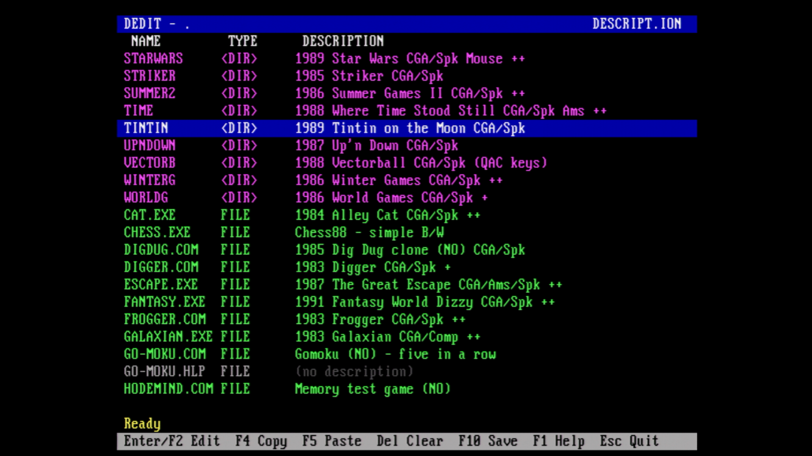

# DEDIT 1.0 - DESCRIPT.ION Editor

A full-screen DOS editor for 4DOS-compatible `DESCRIPT.ION` files and a
companion to [DES](../DES/README.md). DEDIT combines the description file with
the real directory contents, making missing descriptions and stale entries
easy to find.

By **Dag Erik Hagesæter / Retro Erik using Codex in VS Code** - [YouTube: Retro Hardware and Software](https://www.youtube.com/@RetroErik)


[](LICENSE)

## Overview

DEDIT opens the `DESCRIPT.ION` file belonging to the current directory or to a
directory supplied on the command line. The editor always includes the actual
files and subdirectories, even when they have no description.

Lines in `DESCRIPT.ION` that refer to files or directories that no longer
exist are retained and visibly marked `MISSING`. Saving does not silently
discard them.

The program is designed for small, real-mode DOS systems:

| Component | Details |
|-----------|---------|
| **Target platform** | MS-DOS and compatible DOS systems |
| **Executable format** | `.COM` |
| **CPU target** | Intel 8086/8088-compatible instructions |
| **Assembler** | NASM |
| **Maximum entries** | 400 files, directories, and stale lines |
| **Descriptions** | 4DOS-compatible `DESCRIPT.ION` |
| **Colors** | `COLORDIR` rules read directly by DEDIT |
| **Display** | Full-screen 80-column text mode |

## Features

- Shows every directory and file, including entries without descriptions.
- Marks hidden entries with `H` and system entries with `S` in the type column.
- Retains stale description lines and marks them `MISSING`.
- Sorts directories first, files second, and missing entries last.
- Provides insert-mode editing with cursor, Home, End, Backspace, and Delete
  keys.
- Copies and pastes descriptions through an internal clipboard.
- Reads the same `COLORDIR` environment variable as DES and 4DOS.
- Updates the screen directly without navigation flicker.
- Writes a complete temporary file before replacing `DESCRIPT.ION`.
- Preserves the previous description file as `DESCRIPT.BAK`.
- Does not require 4DOS, `ANSI.SYS`, `ANSI.COM`, or a mouse driver.

## Quick Start

### Requirements

- NASM, if you want to rebuild the program.
- DOSBox or a real DOS-compatible computer, if you want to run it.
- An 80-column color or monochrome text mode.

### Build

From this directory:

```text
nasm -f bin dedit.asm -o DEDIT.COM
```

You can also run:

```text
BUILD.BAT
```

The resulting `DEDIT.COM` is a small, self-contained DOS program.

### Run

Copy `DEDIT.COM` to a directory on the DOS path, or run it directly:

```text
DEDIT
DEDIT C:\GAMES
DEDIT /H
```

The optional argument selects a directory, not a wildcard.

## Usage

```text
DEDIT                 Edit the current directory
DEDIT C:\GAMES        Edit C:\GAMES\DESCRIPT.ION
DEDIT /H              Show command-line help
DEDIT /?              Show command-line help
```

Paths are limited to 127 characters. Newly edited descriptions can contain up
to 240 characters. The loaded file and newly edited strings share a 24 KiB
description pool.

## Keyboard Commands

| Key | Action |
|-----|--------|
| `Up`, `Down` | Move one entry |
| `PgUp`, `PgDn` | Move one page |
| `Home`, `End` | Move to the first or last entry |
| `Enter` or `F2` | Edit the selected description |
| `F4` or `Ctrl+C` | Copy the selected description |
| `F5` or `Ctrl+V` | Paste the copied description |
| `Delete` | Clear the selected description |
| `Ctrl+S` or `F10` | Save |
| `F1` | Show the full-screen help page |
| `Esc` | Quit; prompts when changes are unsaved |

Inside the description field, `Left`, `Right`, `Home`, `End`, `Backspace`, and
`Delete` work in the usual way. `Enter` accepts the edit and `Esc` cancels it.

## DESCRIPT.ION

Each description uses the familiar 4DOS format:

```text
MONKEY.EXE Monkey Island  1990 EGA/VGA/ADLIB
```

Names are matched case-insensitively. Blank descriptions are supported.
`DESCRIPT.ION`, `DESCRIPT.BAK`, and the temporary `DESCRIPT.$$$` file are not
shown as editable directory entries.

Saving follows this sequence:

1. Write every retained description to `DESCRIPT.$$$`.
2. Close the completed temporary file.
3. Rename the old `DESCRIPT.ION` to `DESCRIPT.BAK`.
4. Rename `DESCRIPT.$$$` to `DESCRIPT.ION`.

If writing fails, the original file is left in place.

## COLORDIR

DEDIT reads the `COLORDIR` environment variable directly. 4DOS is not
required. For example:

```text
SET ColorDir=dirs:bri mag; zip arj:bri blu; com exe:bri gre; bat:bri red; gif jpg png:yel; txt me now:gre
```

Directory rules use `dirs`; file rules use extensions. Unmatched entries use
the current screen color. The selected row uses a clear highlight, while stale
entries are marked with a red `MISSING` label.

The list uses the same description column as DES: descriptions begin at column
23 (zero-based), leaving 57 visible characters on an 80-column screen. The
`H` and `S` indicators identify DOS hidden and system attributes without
reducing that description width.

## Related Projects

[DES - Description Enhanced System](../DES/README.md) is DEDIT's companion
directory-listing program. DES displays files and directories together with the
descriptions maintained by DEDIT, using the same `COLORDIR` rules.

## Technical Notes

- The source uses only 8086/8088-compatible instructions.
- The executable is a `.COM` program and uses the remainder of its DOS segment
  for runtime buffers.
- DOS `Find First` and `Find Next` collect normal, read-only, hidden, system,
  archive, and directory entries.
- The type column displays `H` for DOS attribute `02h` and `S` for attribute
  `04h`.
- Descriptions are loaded once and matched case-insensitively in memory.
- Screen rows are written directly to `B800h` or `B000h` video memory.
- Cursor movement repaints rows without clearing the screen, avoiding flicker.
- `COLORDIR` supports `dirs`, three-character extensions, `bri`, and the color
  names used by DES and 4DOS.

## Project Layout

| Path | Purpose |
|------|---------|
| `dedit.asm` | NASM source code |
| `DEDIT.COM` | Compiled DOS program |
| `BUILD.BAT` | DOS build helper |
| `LICENSE` | CC BY-NC 4.0 license notice |
| `Screenshots/` | Screenshots of DEDIT in use |
| `test/` | DOSBox configurations, fixtures, and keyboard workflow helper |

## Screenshots

*DEDIT showing directories and files with `COLORDIR` colors, descriptions, and
the selected entry highlighted:*

<p>

</p>

## Testing

The `test` directory contains a real description file, described and
undescribed files, a subdirectory, and a stale entry. DOSBox configurations
cover:

- Command-line help and invalid paths.
- Navigation, editing, copy, paste, save, and quit.
- Preservation of the previous file as `DESCRIPT.BAK`.
- Preservation of stale `MISSING` entries.
- Compatibility between DEDIT output and DES.

The automated editor workflow uses `test/INJECT.COM`, built from
`test/inject.asm`, to place test keys in the BIOS keyboard buffer.

## Possible Future Features

- Search by filename or description using `F3`.
- Multi-selection and bulk description paste.
- Explicit removal or relinking of stale entries.
- Importing descriptions from another directory.
- Optional DOS mouse-driver support.
- A 43/50-line EGA/VGA layout showing more entries.

## Credits

- **Author:** Dag Erik Hagesæter / Retro Erik
- **Development:** Dag Erik Hagesæter / Retro Erik using Codex in VS Code

## License

This project is licensed under the **Creative Commons Attribution-NonCommercial
4.0 International License (CC BY-NC 4.0)**. You may use and modify DEDIT for
non-commercial purposes, provided that appropriate credit is given to Dag Erik
Hagesæter / Retro Erik.

## Contributing

Bug reports, DOS compatibility testing, documentation improvements, and pull
requests are welcome. Please include the DOS version, machine or emulator,
directory contents, keys used, and observed behavior.

---

## YouTube

For more retro computing content, visit **Retro Hardware and Software**:
[https://www.youtube.com/@RetroErik](https://www.youtube.com/@RetroErik)
