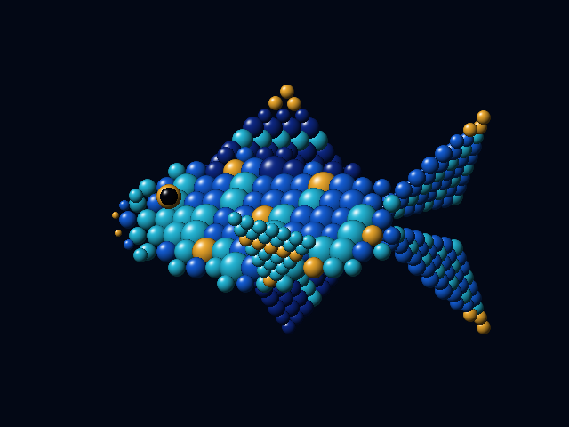
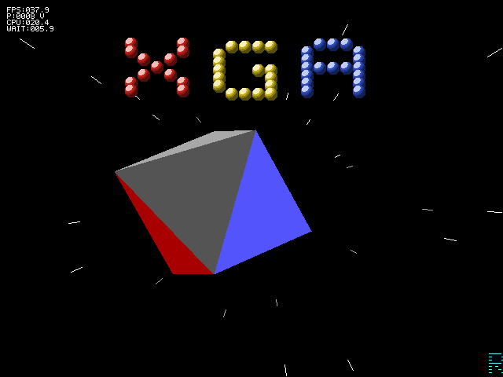
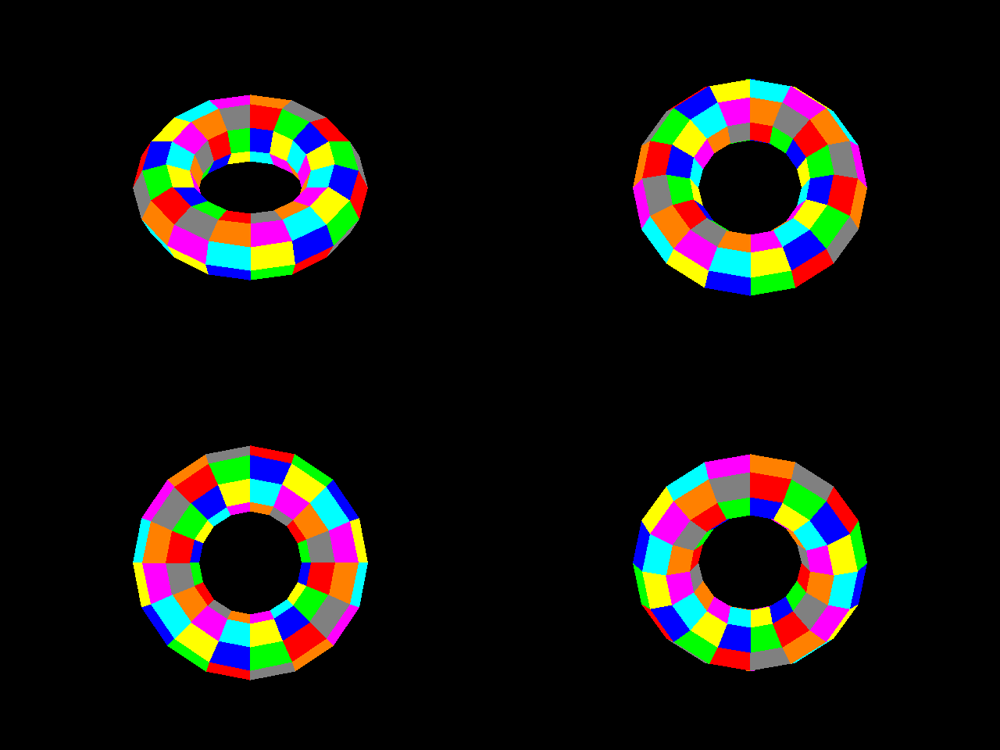
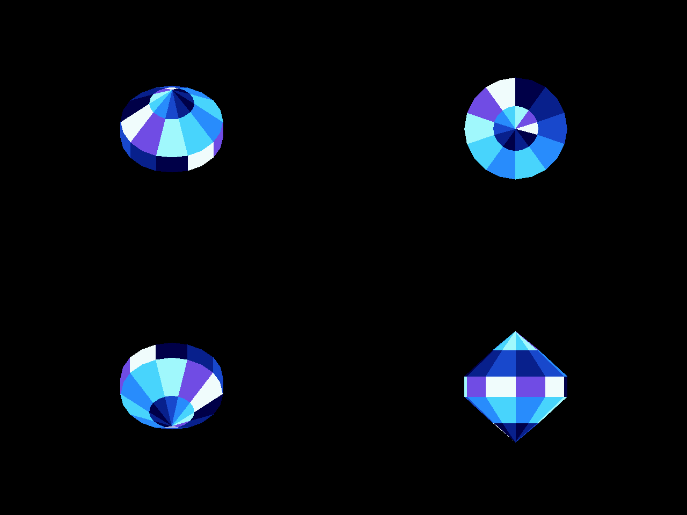

# XGA Demos

A bootable DOS graphics demo collection for an IBM PS/2 Model 55 SX with MCA
XGA-1. The combined disk includes `XDEMO2` and `XGADEMO`. The
panorama programs display `assets/Dreams.bmp` at 640 × 480 in 256 colors and
compare three ways to move a viewport. `XBALLS.COM` adds seven animation and
BitBLT stress effects. `XVECTOR.COM` adds XGA line drawing, Area Fill tests,
and masked mesh filling.

**Ready-to-run floppy image:** [Download XGA Demos (1.44 MB)](bin/v2/XGA-Demos_2026-10-01.img).
Mount it as drive A: in 86Box to run the included demos without building them.

**By Dag Erik Hagesæter / Retro Erik using Codex in VS Code** ·
[Retro Erik on YouTube](https://www.youtube.com/@RetroErik)


[](https://creativecommons.org/licenses/by-nc/4.0/)

## Overview

The project compares XGA display panning (`XGAPAN`), XGA BitBLT copying
(`DBLIT`), and CPU copying (`DCPU`) of the same 640 × 480 viewport. Their
verified movement is a simple back-and-forth pan calculated each loop.
`XBALLS` is a separate V2 program for animated balls, a 3D-style orbit, a
Norwegian flag, a swimming fish, and copy-count stress tests.

| Program | Version | Work per frame | Purpose |
| --- | --- | --- | --- |
| `XGAPAN.COM` | V2 (`DREAMS.COM` in V1) | Changes the XGA display start address | Pans without copying the viewport |
| `DBLIT.COM` | V1, V2 | XGA BitBLT copies 640 × 480 pixels within VRAM | Compares hardware copying speed |
| `DCPU.COM` | V1, V2 | CPU moves banked VRAM through a RAM row buffer | Comparison without BitBLT |
| `XBALLS.COM` | V2 | XGA fills and masked copies of 7–2048 objects | Animation effects and stress testing |
| `XVECTOR.COM` | V2 | CPU projection plus XGA line drawing, Area Fill, and masked BitBlt | Rotating cube, octahedron, torus, Boing Ball, crystal, and polygon stress |
| `XDEMO2.COM` | V2 | XGA masked BitBlt, lines, and sprite HUD | Waving XGA title, flying stars, rotating solid, and scroller |
| `XGADEMO.COM` | V2 | XGA solid fills and masked BitBlt | CGADEMO5 logo, raster waves, scroller, and PC-speaker score |

**Version 1** is preserved in [`versions/v1/`](versions/v1/), including
source, artwork, COM files, `DREAMS.DAT`, build scripts, and the disk images
from 20:00:09 and 20:35:22 on September 26, 2026. The user tested
`versions/v1/bin/dreams_xga_20260926_203522.img` in 86Box; it boots `DBLIT`.
The preserved V1 release is not edited during V2 development.

**Version 2** is maintained here. The panorama programs now load compressed
`DREAMS.DAT` data; V1 still uses the original uncompressed file. New COM files
and disk images are placed in `bin/v2/`. The first V2 panorama disk was
confirmed to boot DOS and run `DBLIT` in 86Box; that older image is no
longer in the working tree. The combined collection is available in `bin/v2/`.

## Features

- Three panorama methods use the same image and show FPS.
- First-load progress and a VRAM marker allow later runs to reuse cached art.
- `XGAPAN` and `DBLIT` can wait for vertical sync.
- `XBALLS` provides seven effects, speed and density controls, a gradient, and
  FPS, CPU time, and wait time in an XGA hardware sprite.
- `XVECTOR` rotates a wireframe cube, filled octahedron, filled torus, and
  faceted crystal, renders an XGA Boing Ball, and stresses Area Fill with moving triangles.
- `XDEMO2` combines the BOB title, starfield, rotating octahedron, and scroller.
- `XGADEMO` ports the CGADEMO5 logo, raster bars, scrollers, and music to XGA.

## Quick Start

Configure 86Box as an IBM PS/2 Model 55 SX with built-in VGA
(`gfxcard = internal`), an XGA card, and working MCA settings from the IBM
Reference Disk. With `gfxcard = none`, the display was black from POST.
Reference Disk configuration cleared errors 162/163. XGA needs 1 MiB of VRAM
and an enabled 1 MiB or 4 MiB memory aperture in POS.

Mount [`bin/v2/XGA-Demos_2026-10-01.img`](bin/v2/XGA-Demos_2026-10-01.img)
as drive A: in 86Box. Press `Esc` if a demo starts automatically, then run
`XGAPAN`, `XBALLS`, `XDEMO2`, or another included demo from the A: prompt.
`XDEMO2` uses the XGA coprocessor for the waving three-color `XGA` BOB title, an
outward-accelerating star field, the tumbling filled octahedron, and the
bottom `Retro Erik - 2026` scroller. `1` toggles stars, `2` the title,
`3` the scroller, `V` vertical sync, and `Esc` returns to DOS. The octahedron
uses XGA masked copies from a 13 KB DOS-memory mask instead of Area Fill.
The bottom scroller uses one clipped masked copy per frame.
Its original thin strokes remain intact; XDEMO2 scales palette entries to
the XGA's 8-bit range for brighter title, solid, stars, and text.

`XGADEMO` needs an XGA card with 1 MiB VRAM, uses `XGAMASK.DAT` on the same
disk, and exits with `Esc`.
It uses XGA 640 x 480 in 256 colors, not a VGA graphics mode. The upper
scroller keeps the original CGA ROM font and text; a cyan scroller below it
recounts XGA's VGA-compatible coprocessor and hardware-filled raster bars,
then credits the port to GPT6-Sol. Both scrollers advance every frame for
consistent motion. Behind the raster bars and logo, 64 perspective stars fly
outward from the screen center as XGA-filled points and short streaks. The
completed frame is copied from a hidden VRAM page to the display at vertical
sync, so the stars do not draw directly into the visible scanout page.
The static footer is redrawn with
`Ported to XGA by Retro Erik in 2026!` underneath.
The image has passed build and disk read-back checks; Retro Erik confirmed
the starfield in 86Box. Performance on physical XGA hardware is untested.

For comparison, see the original [CGA Demo in 16 Colours running on an EuroPC -
CGA capture, using CGA2SCART Pro with a VGA 15Khz mod](https://www.youtube.com/watch?v=j8ChJX5PfVA).

To run the panorama programs from a DOS prompt:

```text
A:\>XGAPAN
A:\>DBLIT
A:\>DCPU
A:\>XBALLS
A:\>XVECTOR
A:\>XDEMO2
A:\>XGADEMO
```

In `XGAPAN` and `DBLIT`, `S` toggles vertical sync waiting. Waiting starts off;
an `S` after the FPS number means it is enabled. `XGAPAN` waits before changing
the display start address; `DBLIT` waits before copying the viewport.
The first load of `DREAMS.DAT`
shows progress. A marker in spare VRAM lets later runs skip the floppy read
while the image remains cached. A reboot or video mode change may require a
new load.

At startup, the panorama programs write small status files such as
`XGABOOT.TXT`, `XGADET.TXT`, `XGAMODE.TXT`, and `XGAOK.TXT` to the disk.
`XGAOK.TXT` confirms completion of the first BitBLT, not visual correctness.

## Build

Run these commands in the `xga-demo` directory. Python and NASM are required.
The generated `bin/DREAMS.DAT` and `dreams_asset.inc` are included in the
project. Copy `DREAMS.DAT` to the V2 directory before the first build:

```text
New-Item -ItemType Directory -Force bin/v2 | Out-Null
Copy-Item bin/DREAMS.DAT bin/v2/DREAMS.DAT
nasm -f bin xga_dreams.asm -o bin/v2/XGAPAN.COM -l bin/v2/XGAPAN.lst
nasm -f bin -DPAN_STYLE=0 xga_dreams.asm -o bin/v2/DBLIT.COM -l bin/v2/DBLIT.lst
nasm -f bin -DPAN_STYLE=2 xga_dreams.asm -o bin/v2/DCPU.COM -l bin/v2/DCPU.lst
python make_dreams_floppy.py --program DBLIT
```

The script makes a timestamped image in `bin/v2/` without modifying the
source disk. By default it uses the archived V1 DOS 6.22 disk. Use
`--source <path>` to select another bootable 1.44 MB DOS disk, and
`--program` to select the `AUTOEXEC.BAT` program. The combined image uses
`--include-xgademo` to add `XDEMO2.COM`, `XGADEMO.COM`, and `XGAMASK.DAT`
regardless of the selected startup program. `--include-cgademo5` adds the
original CGA program; `--include-des` adds `DOS Utils/DES/DES.COM` and this
directory's `DESCRIPT.ION` to the disk root. `BUILD.TXT` records the collection, build time, and selected
program. FAT timestamps come from the build time.

To reconvert the original image, run `python prepare_dreams.py` before NASM.
This requires Pillow and ImageMagick. The script uses
`D:\ImageMagick-7.1.2-13-portable-Q16-x64\magick.exe` when available, or
`magick` from `PATH`. Re-conversion may change the image bytes and produce
COM files different from V1.

Build the balls demo and a bootable disk containing all demos:

```text
python make_balls_assets.py
python build_dem7_fish.py
nasm -f bin xga_balls.asm -o bin/v2/XBALLS.COM -l bin/v2/XBALLS.lst
python make_dreams_floppy.py --program XBALLS --include-xgademo --include-cgademo5 --include-des
python make_vector_torus.py
python make_vector_boing.py
python make_vector_crystal.py
python make_vector_area_safety.py
nasm -f bin xga_vector.asm -o bin/v2/XVECTOR.COM -l bin/v2/XVECTOR.lst
python make_dreams_floppy.py --program XVECTOR
```

Build the combined `XDEMO` scene and a DOS 6.22 floppy that runs it on boot:

```text
python make_xdemo_art.py
nasm -f bin xdemo.asm -o bin/v2/XDEMO.COM
python make_dreams_floppy.py --program XDEMO
```

`XDEMO` shows three separately colored dot-BOB letters spelling `XGA`,
animated as a wave above a rotating filled octahedron and a bottom scroller.
Build `XDEMO2` with the additional fast star field and mixed-case scroller:

```text
python make_xdemo_art.py
nasm -f bin xdemo2.asm -o bin/v2/XDEMO2.COM -l bin/v2/XDEMO2.lst
python make_dreams_floppy.py --program XDEMO2
```

Build the CGA port from `CGADEMO.COM` and `CGADEMO5-NASM.asm` and create a
new timestamped `XGADEMO_YYYYMMDD_HHMMSS.img` boot disk:

```text
python make_cgademo_assets.py
nasm -f bin xgademo.asm -o bin/v2/XGADEMO.COM
python make_dreams_floppy.py --program XGADEMO
```

The generator extracts the TCB logo pixels from `CGADEMO.COM` and the scroller
text, music, and 252-frame raster sequence from `CGADEMO5-NASM.asm`. It also
creates the 1-bit XGA mask included on the disk. Both CGA files and NASM on
`PATH` are required to rebuild the assets.

Build the combined dated image after building both programs and their assets:

```text
python make_xdemo_art.py
nasm -f bin xdemo2.asm -o bin/v2/XDEMO2.COM -l bin/v2/XDEMO2.lst
python make_cgademo_assets.py
nasm -f bin xgademo.asm -o bin/v2/XGADEMO.COM -l bin/v2/XGADEMO.lst
python make_dreams_floppy.py --program XDEMO2 --include-xgademo
```

The CPU generates positions and each frame's octahedron mask; the title mask
is generated at build time. The XGA draws the scene. The disk builder leaves
the archived boot floppy untouched and checks
all copied files byte for byte. The combined disk still needs a boot test in
86Box; the individual demos have been captured there.

Copy both `XBALLS.COM` and `XBALLS.DAT` to a DOS disk to run on a PS/2 with
MCA XGA-1 or XGA-2 and 1 MiB VRAM. The disk builder reads the FAT files back
and checks that they match the built files byte for byte.

## XGA Vector Controls

| Key | Effect | Behavior |
| --- | --- | --- |
| `1` | Rotating wireframe cube | Eight CPU-projected vertices and twelve XGA-drawn edges; full 3D rotation |
| `2` | Solid octahedron | Eight CPU-rotated, depth-sorted triangle faces, each with its own XGA Area Fill |
| `3` | Moving polygon stress | 64 filled triangles initially; `+`/`-` doubles or halves the count from 8 to 512 |
| `4` | Filled torus | 128 mesh quads, depth sorted; about 60–67 front-facing quads filled per frame |
| `5` | XGA Boing Ball | Rotating checker sphere, bouncing motion, speaker chirp, surface shading, cached room grid, and floor shadow |
| `6` | Faceted crystal | 100 colored facets; approximately 40–50 face the camera at a time |
| `M` | Mesh fill method | In modes 4–6, switches between hybrid XGA Area Fill (default) and the proven RAM mask |
| `Space` | Next demo | Cycles through modes 1–6 |
| `V` | Vertical sync | Toggles bounded retrace waiting; enabled at startup |
| `Esc` | Exit | Returns to DOS |

The vector HUD uses the same XGA hardware sprite and FPS, CPU, and WAIT
fields as `XBALLS`. `P` shows the selected triangle count in mode 3 and the number of quads actually
filled in modes 4 and 5. Use `V`
to disable vertical sync when measuring the maximum rate. These timings
include CPU command setup and XGA work in the selected environment.
An `A` after the polygon count means the hybrid Area Fill mode is selected;
without it, every mesh facet uses the RAM mask.

The Boing Ball adapts the separate `CGA Boing/CGABoing.asm` demo to XGA:
there are no CGA bank offsets, packed CGA pixels, or CPU frame-buffer copies.
The CPU transforms a checkered sphere and culls its back faces; depth sorting
is unnecessary for this convex ball. The XGA coprocessor fills its visible
quads with darker colors on the lower hemisphere, draws the floor shadow,
and copies the completed hidden page to the visible page with XGA BitBlt.
The room grid is drawn once into spare VRAM and restored with one XGA BitBlt
per frame. The ball uses a bounce lookup table and the PC speaker. The sound
routine preserves the position register so a left-wall impact cannot reverse
the ball a second time. Adjacent checker colors alternate at every longitude
segment. In hybrid mode, a precomputed table selects XGA Area Fill for quads
with a clean area boundary and the RAM mask with XGA masked BitBlt for the
others. Press `M` to use the confirmed RAM-mask path for every quad.

## XGA Balls Controls

| Key | Effect | Behavior |
| --- | --- | --- |
| `1` | Original ellipse orbit | One central ball and six equally sized pink satellites in the screen plane |
| `2` | Original sine snake | Thirteen pink 48 × 48 balls |
| `3` | Copy stress test | `+`/`-` doubles or halves 16–2048 copies of a 48 × 48 ball |
| `4` | Dense sine bands | `+`/`-` selects 32, 64, 128, or 256 distinct 24 × 24 balls; 128 is the default |
| `5` | Shaded bitmap balls in 3D positions | Central ball and six satellites on ±X, ±Y, and ±Z; `+`/`-` adjusts speed |
| `6` | Waving Norwegian flag | 792 colored 16 × 16 balls form a moving 33 × 24 grid |
| `7` | Swimming fish | 294 shaded balls in eight sizes and five colors; body and tail move in a wave |
| `Space` | Next effect | Cycles through all seven effects |
| `T` | Masking | Toggles the one-bit copy mask in modes 1–4 |
| `G` | Gradient | Toggles a dark gradient; modes 5–7 otherwise use a dark teal background |
| `V` | Vertical sync | Toggles retrace waiting; enabled at startup |
| `Esc` | Exit | Returns to DOS |

The hardware sprite in the upper-left corner shows `FPS`, `B` (ball copies
per frame), `CPU`, and `WAIT`. Mode 5 replaces `B` with `S` (speed level).
A trailing `V` indicates that vertical sync waiting is enabled. `CPU` and
`WAIT` are **milliseconds per frame**, displayed to one decimal place.
`WAIT` counts time spent polling for XGA coprocessor completion and vertical
retrace. `CPU` is the rest of the frame time, including command submission,
calculations, and HUD work. It is not operating-system CPU utilization or
isolated blitter occupancy. The averages use at least 36 BIOS ticks (about
two seconds); a latched PIT counter measures explicit waits. The display caps
each value at 999.9.

Mode 5 starts at `S0004`. Speed levels `S0001`–`S0006` each double the
rotation speed. At 60 completed FPS, one turn takes approximately 136, 68,
34, 17, 8.5, or 4.3 seconds respectively. Actual time follows the measured
FPS, so disabling vertical sync can make the rotation faster.

## Performance and Technical Notes

In mode 3, the first 256 copies fill a 16 × 16 grid. Higher counts redraw
the same grid; `B2048` means 2048 BitBLT commands, not 2048 distinct visible
balls. Mode 4 uses 32 balls per sine band, giving one, two, four, or eight
bands. Four color variants help separate the bands.

The 128 small balls in mode 4 account for 73,728 source pixels per frame,
versus 589,824 for 256 copies of the 48 × 48 ball in mode 3. Command setup
and coordinate calculations add CPU work. A black mode-3 frame also fills
307,200 screen pixels; with 7, 13, 256, and 2048 large-ball copies, the
fill-plus-copy pixel totals are 323,328, 337,152, 897,024, and 5,025,792.
These are workload counts, not measured speeds.

For a capacity test, select `3`, press `V` to remove the `V` indicator, and
increase `B` until FPS drops. With vertical sync enabled, check how many
copies still meet the display refresh rate. Repeat on a physical 55sx;
86Box figures describe the emulator. The animation loop uses an integer sine
table and no floating point calculations.

The original 48 × 48 balls have 16 palette colors. With `T` enabled, an XGA
one-bit pattern map copies pixels where the mask is 1 and preserves the
background where it is 0. The ball bitmap is 2,304 bytes and its mask is
288 bytes. They are loaded into VRAM once, after two 307,200-byte screen
pages. Modes 5 and 6 draw into the hidden page and present the completed
frame with one VRAM-to-VRAM BitBLT. The mode-5 art is generated into the
196,608-byte `XBALLS.DAT` file with two 4-bit palette indices per byte on
full bitmap pages. On the first entry to mode 5, a visible progress bar
tracks the 86 pages as they expand into XGA banks 9–14; subsequent mode
changes reuse the cached art until the program exits. The loader reads up
to 16 KiB at a time (13 data reads plus an EOF check), without changing
the DAT format or artwork. The other modes start
without reading `XBALLS.DAT`;
the flag assets start in bank 15, and mode 7 generates its bitmaps and masks
there on first entry.
The 3D position table stays in the COM
file in system memory. The program shares XGA detection, 640 × 480 setup,
and coprocessor timeout handling with `xga_dreams.asm`.

In mode 5, six satellites are **shaded bitmap balls** in projected 3D
positions. A generated table has 512 depth-sorted positions. Sixteen
diameters from 80 to 184 pixels retain the 8-pixel steps except for new
148- and 172-pixel intermediate balls. The two intermediate masks and
bitmaps use byte-aligned 152- and 176-pixel canvases. Z-size transitions
remain discrete elsewhere. The CPU interpolates screen
coordinates with integer arithmetic between table positions. All seven
balls use the original pink 16-color shading from modes 1–3; a solid one-bit
mask preserves the background outside each ball. A hidden page removes the
flash caused by clearing the visible page. A full-page present may still
show tearing with `V` off. The previous 14-size bitmap version rendered
correctly in 86Box. The 16-size artwork looked good in 86Box before this
read-batching experiment; its loading time and appearance after batching
still need to be checked against the previous roughly 20-second load.

In mode 6, the flag has a 22:16 ratio and a blue cross with a white border on
red. Three color variants of the 16 × 16 bitmap share one circular mask. A
sine wave displaces columns increasingly toward the free edge. Each frame
uses 792 masked BitBLTs, a fill, and a full-page present. The user observed
59.6 FPS with vertical sync enabled in 86Box: `CPU:016.3` and `WAIT:000.4`
mean approximately 16.3 ms outside explicit waits and 0.4 ms in them per
frame. The complete frame takes about 16.8 ms (1000 / 59.6); the small
difference from the displayed sum is rounding and timing-window resolution.
Emulated XGA work may execute during CPU command submission, so these
numbers do not isolate the hardware blitter or predict physical-card speed.

In mode 7, one left-facing fish uses 294 balls with eight diameters from
8 to 36 pixels and five color families. The head and eye stay nearly still;
an increasing sine displacement moves the body and forked tail as it swims
in place. The CPU generates eight masks and 40 shaded bitmap variants in
bank 15 on first entry. No mode-7 ball bitmaps or masks are stored on the
disk; the COM contains packed fish coordinates and five 10-shade palette
ramps. Subsequent visits reuse the generated VRAM art. Like modes 5 and 6,
mode 7 uses a hidden page and one full-page present per frame. The Python
preview below is reference artwork; the animated XGA rendering uses nine
visible shades per base color. Assembly and disk read-back passed, but the
swimming motion has not yet been measured in 86Box or on physical XGA.

The 86Box 6.0 build 9001 measurements below were reported by the user with
`V` **off**. Every frame includes a 640 × 480 screen fill. Calculated copies
per second are FPS multiplied by ball copies per frame.

| 48 × 48 copies/frame | FPS without VSYNC | Calculated copies/s |
| ---: | ---: | ---: |
| 256 | 200 | 51,200 |
| 512 | 103 | 52,736 |
| 1024 | 52 | 53,248 |
| 2048 | 26 | 53,248 |

| Distinct 24 × 24 balls/frame | FPS without VSYNC | Calculated copies/s |
| ---: | ---: | ---: |
| 128 | 337 | 43,136 |
| 256 | 170 | 43,520 |

These results correspond to roughly 51,000–53,000 large-ball copies or
43,000 small-ball copies per second in this emulator setup. They are derived
from HUD FPS, not isolated measurements of the blitter or a physical XGA-1.
Earlier sync settings were not recorded for the 60/30/20 FPS observations
at 256/1024/2048 large-ball copies.

## Builds and Test Status

Earlier dated XBALLS test disks have been removed from the working tree.
The combined disk linked in Quick Start is the available image. User
screenshots confirm the shaded bitmap balls in mode 5 and the fish's colors
in mode 7. The latest swimming animation was assembled and its boot disk
passed FAT12 read-back; its motion, FPS, mode switching, and physical-XGA
performance still need testing. To check it, run `XBALLS`, press `7`, observe
the moving tail, then switch to mode 5 and back to 7 with `5` and `7`.

The following software previews are reference art, not XGA captures.




## How XVECTOR Works

XVECTOR scales its 0-63 palette channels to the XGA's 8-bit range for brighter
vector and solid colors. Retro Erik confirmed the corrected brightness.

In mode 1, the 386SX rotates eight cube vertices around the X and Y axes
using a 256-step integer sine table, projects them, and selects the twelve
edge endpoints. The XGA coprocessor receives each endpoint pair and draws
the 2D line. Both axes complete a full turn without the position reset of
the earlier offset-square version. XGA also clears the hidden 640 × 480 page
and presents it with a VRAM-to-VRAM BitBLT. The CPU does not rasterize edges.

Mode 2 draws eight triangular faces of an octahedron.
Each frame the CPU rotates six vertices around one axis with the integer
sine table, projects them orthographically (no perspective divide yet), sums
the three rotated Z values per face, and bubble-sorts the eight faces
farthest-first. The XGA then draws each face's three edges into the 1-bit
boundary map and fills it with its own palette color, one Area Fill per
face. The XGA has no z-buffer, so this CPU-side painter's-algorithm sort is
what keeps nearer faces drawn over farther ones. Earlier builds showed
horizontal stripes. Boundary drawing now uses XOR with mask-map scissoring
disabled, as required by the
[XGA Software Programmer's Guide](https://www.transputer.net/ibooks/72-oek-258-00/xgaprog.pdf).
The equatorial vertices share a scan line, and edge-on faces narrower than
two pixels are skipped. The author confirmed that the resulting solid has
no remaining stripes.

Mode 3 starts with 64 filled triangles and can be adjusted from 8 to 512.
Two triangles form each colored diamond. The diamonds move independently
using offset phases from the integer sine table. For every triangle, the XGA
coprocessor clears only its 30 × 22 area in the 1-bit boundary map, draws
three boundary lines with XOR, then performs an Area Fill PxBlt into the
hidden 8-bit page. Thus `P` counts separate hardware polygon fills per frame,
while FPS includes CPU setup, the final page copy, and optional VSYNC waiting.

Mode 4 is a filled 3D torus. `make_vector_torus.py` generates 128 vertices
and 128 quads. The 386SX rotates the vertices, projects them, sorts quads by
depth, and skips back-facing or twisted quads. The default hybrid renderer
looks up the 512-phase area-boundary table by rotation and quad index. XGA
clears a small area of the 1-bit VRAM map, draws four XOR area-boundary lines,
and fills the bounded rectangle for a clean quad. Quads whose simulated
boundary has an odd scanline or a larger shape mismatch use the established
system-RAM mask and XGA masked BitBlt. `M` selects the RAM mask for all quads.
The Area Fill command uses octant 0, as IBM requires increasing X for this
operation. The four boundary lines may each run in either direction.
`P` shows the quads actually filled in that frame. Integer geometry checks
found 60–67 visible quads across a full rotation. Modes 4–6 render into the
hidden 307,200-byte page and present it with one XGA BitBlt. An attempted
display-start page flip showed only a small fragment of the torus in 86Box
and was removed.

In the author's preceding 86Box capture, mode 5 showed about 34.3 FPS,
29.0 ms CPU, and 0.0 ms WAIT; mode 4 showed about 31.3 FPS, 31.8 ms CPU,
and 0.0 ms WAIT. `WAIT` measures explicit coprocessor and retrace stalls;
it does not isolate all emulated XGA work from the HUD's `CPU` figure. The cached
Boing grid replaces 51 line commands per frame with one XGA BitBlt, and
sphere depth sorting has been removed. CPU-generated quad masks replace
boundary lines and Area Fill with one masked BitBlt per visible quad. The
user confirmed that the VRAM mask removed the stripes but reduced speed
from about 26 to 6.0 FPS. With fixed-point edge stepping, the user's 64-quad
capture still showed 154.4 ms CPU and 9.3 ms WAIT per frame. This indicates
that edge division was not the main cost. The RAM-mask version reached
8.5 FPS, 106.9 ms CPU, and 9.4 ms WAIT for 56 Boing quads, without stripes.
In 86Box, a write to the XGA command register executes the operation in the
same emulator call. An experimental timing HUD showed a much larger mask
cost than fill cost, but its `MASK` value exceeded the entire frame time;
those stage milliseconds were not reliable and have been removed. The
hybrid uses Area Fill for roughly half of the visible torus quads at many
rotation phases. Its table is generated by `make_vector_area_safety.py` from
the mesh and 86Box's area-boundary line rules. The user confirmed that the
full-page present and RAM mask in the preceding build show the complete torus
and ball. In the first hybrid test, the torus measured 12.7 FPS in Area Fill
mode and 9.3 FPS in pure mask mode, but Area Fill produced malformed quads.
The fourth Area Fill edge had used a stale endpoint from an earlier mask quad;
the current build explicitly closes every quad before drawing its boundary.
The author confirmed the corrected torus is visually complete at about
14.1 FPS, 67.6 ms CPU, and 0.0 ms WAIT in 86Box.

Mode 6 is a convex faceted crystal. `make_vector_crystal.py` generates 120
vertices over six profile rings and 100 colored facets. The pointed end
facets use a repeated vertex; their zero-length edge is skipped. Backface
culling removes hidden facets, so this mesh needs no depth sort. A third
512-phase safety table selects direct XGA Area Fill for clean outlines and
the RAM-mask/XGA BitBlt path for the rest. Static geometry checks found
40–50 visible facets at representative rotation phases, with 25–50 using
Area Fill. `M` can force every facet through the mask for comparison.

### Moving Polygon Stress Results

The author measured these values with the XGA setup shown in the screenshots.
`P` counts filled triangles per frame; FPS measures the entire frame.

| Filled triangles | FPS | CPU (ms) | WAIT (ms) |
| ---: | ---: | ---: | ---: |
| 64 | 74.3 | 13.4 | 0.0 |
| 128 | 37.4 | 26.7 | 0.0 |
| 256 | 18.7 | 53.4 | 0.0 |
| 512 | 9.3 | 106.9 | 0.0 |

The rate is approximately 4,800 filled triangles per second across these
settings. Doubling `P` almost doubles frame time. The reported `WAIT` stayed
at 0.0 ms, so the measurements show little or no time waiting for XGA to
finish commands; CPU geometry and command setup remain part of the FPS cost.
In 86Box, synchronous command emulation can also contribute to `CPU`.
This is end-to-end demo throughput, not a standalone coprocessor benchmark.

`XVECTOR.COM` is 42,897 bytes in the current build. Its VRAM layout uses the
visible page at offset 0, hidden page at offset 307,200, 1-bit pattern map
at offset 614,400, and cached Boing room at offset 652,800. The torus, Boing,
and crystal modes temporarily remap the 1-bit pattern map to a 2,048-byte buffer
inside the COM program's conventional RAM when a mask fallback is used.
Three 8,192-byte phase tables select the fill method. No vector artwork is
loaded. The shared
runtime waits for the coprocessor before map or command changes, and `Esc`
restores the previous DOS video mode.

## XVECTOR Test Status

| Check | Status |
| --- | --- |
| NASM assembly and COM-size check | Passed; 42,897-byte `XVECTOR.COM` |
| Disk FAT read-back | Passed for an earlier V2 build; the renamed combined disk has not been rechecked |
| Palette brightness | Retro Erik confirmed the corrected colors |
| Area safety table generation | Passed for 512 rotation phases and all three meshes |
| Static mode/register review | Passed for hidden-page setup, present BitBLT, bounded waits, and boundary XOR/mask settings |
| Rotating cube | Full-cycle geometry checked; visual test pending |
| Solid octahedron | User confirmed the corrected build has no remaining stripes |
| Moving polygon stress, mode 3 | User measured 64-512 filled triangles; see table above |
| Filled torus, mode 4 | User confirmed the corrected hybrid renders the whole torus at about 14.1 FPS |
| Boing Ball, mode 5 | User confirmed the preceding RAM-mask build shows the full ball; hybrid build awaits visual and FPS test |
| Faceted crystal, mode 6 | Build and static rotation checks passed; 86Box visual and FPS test pending |
| Physical IBM PS/2/XGA-1, corrected build | Not tested |

## How the Panorama Programs Work

`DREAMS.DAT` contains a 768-byte RGB palette followed by 614,400 indexed
pixels for a 960 × 640 image. The visible 640 × 480 area uses 307,200 bytes
in XGA map A; the source image uses 614,400 bytes in map B. Together they
use 921,600 of the card's 1,048,576 VRAM bytes. The image loads from floppy
to VRAM once, and animation then reads VRAM. The machine's 4 MiB RAM does
not hold the whole image.

All three programs show `FPS:000.0` using an XGA 64 × 64 hardware sprite.
FPS counts completed program loops against BIOS ticks over about two
seconds. The display caps at **999.9**. It does not count distinct images
actually scanned out. An 86Box reading does not establish physical XGA-1
speed. With `S` enabled, `XGAPAN` waits before changing the display start
address and `DBLIT` waits before each copy; one visible buffer can still tear.

`XGAPAN` changes the XGA display start address instead of copying 307,200
pixels each loop. To make 86Box redraw after the change, it rewrites one
unchanged byte per 4 KiB page of the source image. `DBLIT` uses the XGA
coprocessor for VRAM-to-VRAM copies. `DCPU` moves the same viewport through
the CPU and a 640-byte RAM row buffer.

A future rotating zoom of a large bitmap needs another method. XGA BitBLT
copies rectangles without arbitrary rotation or scaling. Narrow strips,
precomputed images, or CPU calculations could approximate the effect, but
performance on a 386SX-16 must be measured before choosing an approach.

## Project Layout

| Path | Contents |
| --- | --- |
| `versions/v1/` | Preserved V1 source, data, disks, and `SHA256SUMS.txt` |
| `xga_dreams.asm` | Shared V2 source for the three panorama programs |
| `xga_vector.asm`, `xga_torus_mesh.inc`, `xga_boing_mesh.inc`, `xga_crystal_mesh.inc` | XVECTOR rotating solids, polygon stress, and generated meshes |
| `xga_balls.asm`, `xga_balls_runtime.inc`, `xga_balls_hud.inc` | Ball animation, XGA setup, and timing sprite |
| `make_balls_assets.py`, `make_xga_fish.py`, `build_dem7_fish.py`, `xga_balls_sine.inc`, `xga_dense_palette.inc`, `xga_orbit_palette.inc`, `xga_orbit3d_frames.inc`, `xga_flag_palette.inc`, `xga_flag_colors.inc`, `xga_morph_shapes.inc`, `xga_morph_palette.inc` | Generators and lookup tables |
| `assets/xga_ball*.bin`, `assets/xga_orbit_masks.bin`, `assets/xga_flag*.bin`, `preview_new_balls.py` | Bitmap art, masks, and static preview generator; the legacy `assets/xga_morph_masks.bin` is not used by mode 7 |
| `bin/v2/` | V2 executables, listings, `XBALLS.DAT`, and the combined bootable image |
| `make_dreams_floppy.py` | Bootable V2 disk builder |
| `DESCRIPT.ION` | English file descriptions for the optional DES.COM floppy listing |
| `make_vector_torus.py` | Rebuilds the torus geometry include file |
| `make_vector_boing.py` | Rebuilds the Boing Ball geometry include file |
| `make_vector_crystal.py` | Rebuilds the crystal geometry include file |
| `make_vector_area_safety.py`, `xga_area_safety.inc` | Generate and store the 512-phase Area Fill fallback table |

`xga_panorama.asm` and `make_test_floppy.py` are older development tests.
`versions/v1/` can be rebuilt, but new experiments belong in V2 files.

## Screenshots

XBALLS modes 1-6 running in 86Box. The mode-7 fish has a Python reference
preview above, but no 86Box screenshot here yet.

| Orbit (1) | Sine snake (2) |
| --- | --- |
|  |  |
| Copy stress (3) | Dense sine bands (4) |
|  |  |
| Shaded 3D orbit (5) | Norwegian flag (6) |
|  |  |

[Watch XBALLS mode 6 in 86Box](Screenshorts/Xballs%20Demo%206.mp4).

XDEMO2 running in 86Box with the XGA title, octahedron, starfield, and
bottom scroller:



[Watch XDEMO2 running in 86Box](Screenshorts/Xdemo2.mp4).

XGADEMO running in 86Box with the TCB logo, raster bars, starfield, and two
independent scrollers:


[Watch XGADEMO running in 86Box](Screenshorts/XGADEMO.mp4).


The following software preview shows four torus orientations. It is a
geometry check, not an XGA capture.



The crystal preview shows four projected orientations. It checks mesh shape
and backface culling; it is not an XGA capture.



## Testing, Credits, and License

At the start of V2 development, the three panorama COM files and
`DREAMS.DAT` matched V1 byte for byte. The disk builder verifies new FAT
contents by reading them back. The user confirmed that the V2 panorama disk
boots `DBLIT` in 86Box. The panning program and `DCPU` have not been retested from that
V2 disk. An earlier `XBALLS` image passed build and disk read-back checks,
and the user reports that it now works in 86Box. The exact regression key
sequence was not separately recorded.

Original XGA Demos source code, documentation, and artwork by Dag Erik
Hagesæter / Retro Erik are licensed under the [Creative Commons
Attribution-NonCommercial 4.0 International License (CC BY-NC 4.0)](https://creativecommons.org/licenses/by-nc/4.0/legalcode).
You may share and adapt this original material for non-commercial purposes
with appropriate credit, a link to the license, and an indication of changes.
Bundled DOS 6.22 files and third-party demo material are not covered by this
license grant and retain their own terms. Contributions and test reports
should state the machine, XGA model, emulator version if used, disk image,
VSYNC setting, ball count, and observed FPS.

**By Dag Erik Hagesæter / Retro Erik using Codex in VS Code** ·
[Retro Erik on YouTube](https://www.youtube.com/@RetroErik)
