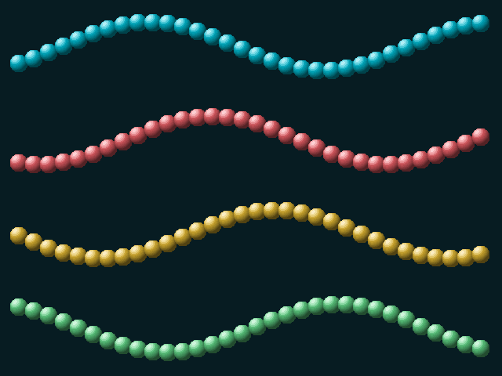
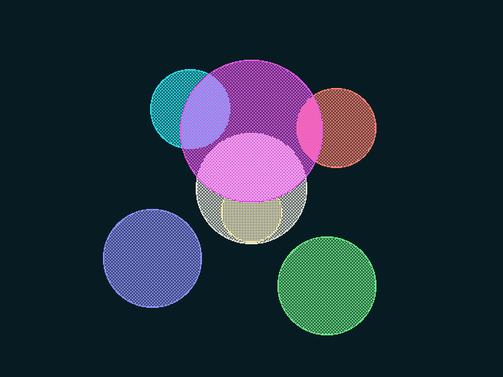
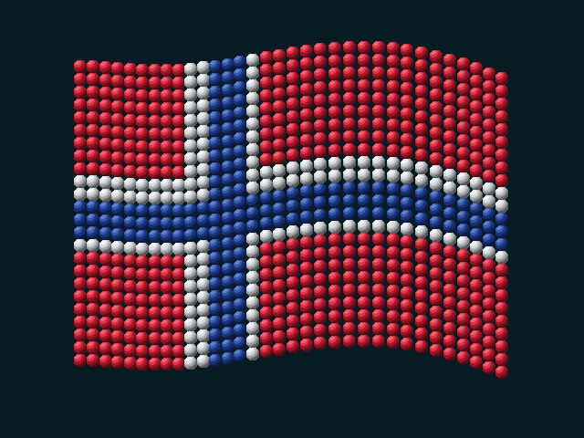
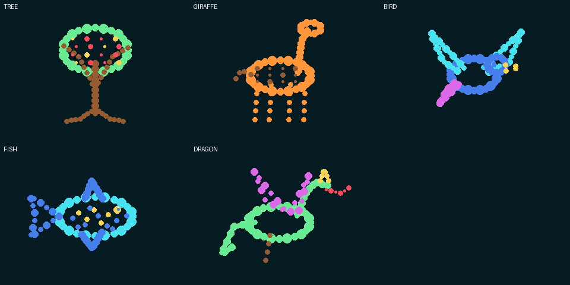
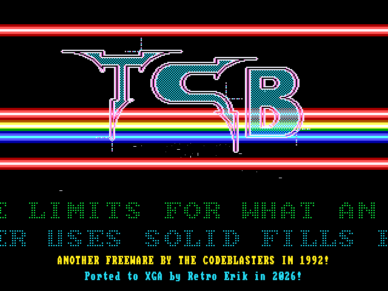
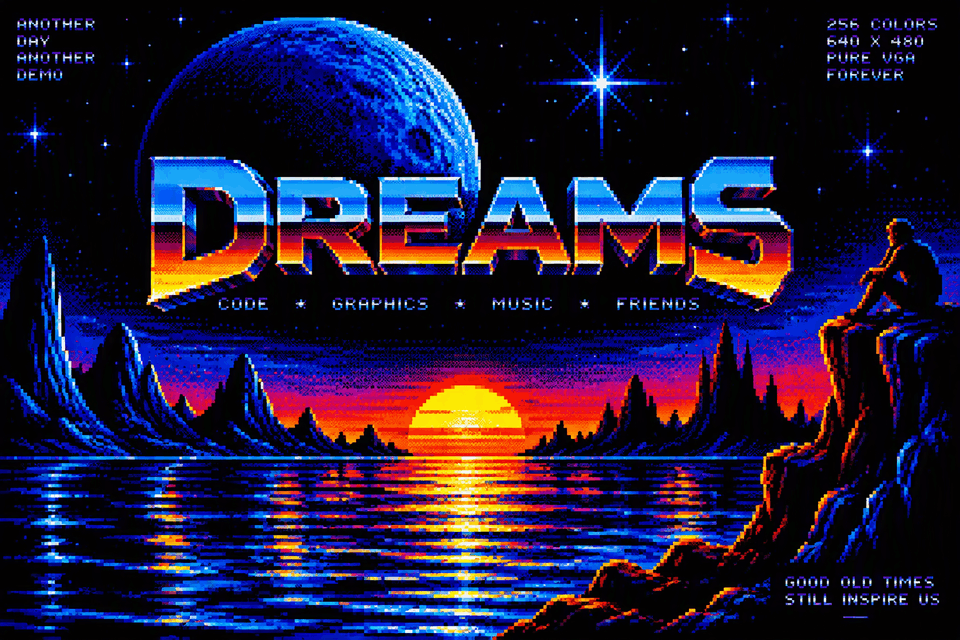

# Dreams XGA Demo — Version 2 in Development

A bootable DOS graphics demo for an IBM PS/2 Model 55 SX with MCA XGA-1. The
panorama programs display `assets/Dreams.bmp` at 640 × 480 in 256 colors and
compare three ways to move a viewport. `XBALLS.COM` adds seven animation and
BitBLT stress effects.

**By Dag Erik Hagesæter / Retro Erik using Codex in VS Code** ·
[Retro Erik on YouTube](https://www.youtube.com/@RetroErik)


## Overview

The project compares XGA display panning (`DREAMS`), XGA BitBLT copying
(`DBLIT`), and CPU copying (`DCPU`) of the same 640 × 480 viewport. Their
verified movement is a simple back-and-forth pan calculated each loop.
`XBALLS` is a separate V2 program for animated balls, a 3D-style orbit, a
Norwegian flag, and copy-count stress tests.

| Program | Version | Work per frame | Purpose |
| --- | --- | --- | --- |
| `DREAMS.COM` | V1, V2 | Changes the XGA display start address | Pans without copying the viewport |
| `DBLIT.COM` | V1, V2 | XGA BitBLT copies 640 × 480 pixels within VRAM | Compares hardware copying speed |
| `DCPU.COM` | V1, V2 | CPU moves banked VRAM through a RAM row buffer | Comparison without BitBLT |
| `XBALLS.COM` | V2 | XGA fills and masked copies of 7–2048 objects | Animation effects and stress testing |
| `XGADEMO.COM` | V2 | XGA solid fills and masked BitBlt | CGADEMO5 logo, raster waves, scroller, and PC-speaker score |

**Version 1** is preserved in [`versions/v1/`](versions/v1/), including
source, artwork, COM files, `DREAMS.DAT`, build scripts, and the disk images
from 20:00:09 and 20:35:22 on September 26, 2026. The user tested
`versions/v1/bin/dreams_xga_20260926_203522.img` in 86Box; it boots `DBLIT`.
The preserved V1 release is not edited during V2 development.

**Version 2** is developed here. `xga_dreams.asm` currently has no functional
changes from V1. New COM files and disk images are placed in `bin/v2/`. The
first V2 panorama image, `dreams_xga_v2_20260928_142112.img`, was confirmed
to boot DOS and run `DBLIT` in 86Box.

## Features

- Three panorama methods use the same image and show FPS.
- First-load progress and a VRAM marker allow later runs to reuse cached art.
- `DBLIT` can wait for vertical sync.
- `XBALLS` provides seven effects, speed and density controls, a gradient, and
  FPS, CPU time, and wait time in an XGA hardware sprite.

## Quick Start

Configure 86Box as an IBM PS/2 Model 55 SX with built-in VGA
(`gfxcard = internal`), an XGA card, and working MCA settings from the IBM
Reference Disk. With `gfxcard = none`, the display was black from POST.
Reference Disk configuration cleared errors 162/163. XGA needs 1 MiB of VRAM
and an enabled 1 MiB or 4 MiB memory aperture in POS.

Mount a bootable image as drive A:. The latest `XBALLS` image is
[`bin/v2/xga_balls_v2_20260928_214224.img`](bin/v2/xga_balls_v2_20260928_214224.img).
It starts `XBALLS` from `AUTOEXEC.BAT`. Press `Esc` to return to DOS.

The CGA port is [`bin/v2/XGADEMO_20261001_133618.img`](bin/v2/XGADEMO_20261001_133618.img).
Mount it as drive A:; DOS starts `XGADEMO` automatically. It needs an XGA
card with 1 MiB VRAM, uses `XGAMASK.DAT` on the disk, and exits with `Esc`.
It uses XGA 640 x 480 in 256 colors, not a VGA graphics mode. The upper
scroller keeps the original CGA ROM font and text; a cyan scroller below it
recounts XGA's VGA-compatible coprocessor and hardware-filled raster bars,
then credits the port to GPT6-Sol. Both scrollers advance every frame for
consistent motion. Behind the raster bars and logo, 64 perspective stars fly
outward from the screen center as XGA-filled points and short streaks. The
completed frame is copied from a hidden VRAM page to the display at vertical
sync, so the stars do not draw directly into the visible scanout page.
The static footer is redrawn with
`Ported to XGA by Retro Erik in 2026!` underneath.
The image has passed build and disk read-back checks; Retro Erik confirmed
the starfield in 86Box. Performance on physical XGA hardware is untested.

For comparison, see the original [CGA Demo in 16 Colours running on an EuroPC -
CGA capture, using CGA2SCART Pro with a VGA 15Khz mod](https://www.youtube.com/watch?v=j8ChJX5PfVA).

To run the panorama programs from a DOS prompt:

```text
A:\>DREAMS
A:\>DBLIT
A:\>DCPU
A:\>XBALLS
A:\>XGADEMO
```

In `DBLIT`, `S` toggles vertical sync waiting. Waiting starts off; an `S`
after the FPS number means it is enabled. The first load of `DREAMS.DAT`
shows progress. A marker in spare VRAM lets later runs skip the floppy read
while the image remains cached. A reboot or video mode change may require a
new load.

At startup, the panorama programs write small status files such as
`XGABOOT.TXT`, `XGADET.TXT`, `XGAMODE.TXT`, and `XGAOK.TXT` to the disk.
`XGAOK.TXT` confirms completion of the first BitBLT, not visual correctness.

## Build

Run these commands in the `xga-demo` directory. Python and NASM are required.
The generated `bin/DREAMS.DAT` and `dreams_asset.inc` are included in the
project. Copy `DREAMS.DAT` to the V2 directory before the first build:

```text
New-Item -ItemType Directory -Force bin/v2 | Out-Null
Copy-Item bin/DREAMS.DAT bin/v2/DREAMS.DAT
nasm -f bin xga_dreams.asm -o bin/v2/DREAMS.COM -l bin/v2/DREAMS.lst
nasm -f bin -DPAN_STYLE=0 xga_dreams.asm -o bin/v2/DBLIT.COM -l bin/v2/DBLIT.lst
nasm -f bin -DPAN_STYLE=2 xga_dreams.asm -o bin/v2/DCPU.COM -l bin/v2/DCPU.lst
python make_dreams_floppy.py --program DBLIT
```

The script makes a timestamped image in `bin/v2/` without modifying the
source disk. By default it uses the archived V1 DOS 6.22 disk. Use
`--source <path>` to select another bootable 1.44 MB DOS disk, and
`--program DREAMS`, `--program DCPU`, or `--program XBALLS` to choose the
`AUTOEXEC.BAT` program. `BUILD.TXT` records the version, build time, and
selected program. FAT timestamps come from the build time.

To reconvert the original image, run `python prepare_dreams.py` before NASM.
This requires Pillow and ImageMagick. The script uses
`D:\ImageMagick-7.1.2-13-portable-Q16-x64\magick.exe` when available, or
`magick` from `PATH`. Re-conversion may change the image bytes and produce
COM files different from V1.

Build the separate balls demo and its bootable disk:

```text
python make_balls_assets.py
python make_morph_assets.py
nasm -f bin xga_balls.asm -o bin/v2/XBALLS.COM -l bin/v2/XBALLS.lst
python make_dreams_floppy.py --program XBALLS
```

Build the CGA port from `CGADEMO.COM` and `CGADEMO5-NASM.asm` and create a
new timestamped `XGADEMO_YYYYMMDD_HHMMSS.img` boot disk:

```text
python make_cgademo_assets.py
nasm -f bin xgademo.asm -o bin/v2/XGADEMO.COM
python make_dreams_floppy.py --program XGADEMO
```

The generator extracts the TCB logo pixels from `CGADEMO.COM` and the scroller
text, music, and 252-frame raster sequence from `CGADEMO5-NASM.asm`. It also
creates the 1-bit XGA mask included on the disk. Both CGA files and NASM on
`PATH` are required to rebuild the assets.

The CPU generates positions and the title's one-bit masks; the XGA draws the
scene. The disk builder leaves the archived boot floppy untouched and checks
all copied files byte for byte. Visual output still needs testing in 86Box.

`XBALLS.COM` can also be copied to a DOS disk and run on a PS/2 with MCA
XGA-1 or XGA-2 and 1 MiB VRAM. The disk builder reads the FAT files back and
checks that they match the built files byte for byte.

## XGA Balls Controls

| Key | Effect | Behavior |
| --- | --- | --- |
| `1` | Original ellipse orbit | One central ball and six equally sized pink satellites in the screen plane |
| `2` | Original sine snake | Thirteen pink 48 × 48 balls |
| `3` | Copy stress test | `+`/`-` doubles or halves 16–2048 copies of a 48 × 48 ball |
| `4` | Dense sine bands | `+`/`-` selects 32, 64, 128, or 256 distinct 24 × 24 balls; 128 is the default |
| `5` | Flat discs in 3D positions | Central disc and six satellites on ±X, ±Y, and ±Z; `+`/`-` adjusts speed |
| `6` | Waving Norwegian flag | 792 colored 16 × 16 balls form a moving 33 × 24 grid |
| `7` | Morphing figures | 96 balls form Tree → Giraffe → Bird → Fish → Dragon → Tree |
| `Space` | Next effect | Cycles through all seven effects |
| `T` | Masking | Toggles the one-bit copy mask in modes 1–4 |
| `G` | Gradient | Toggles a dark gradient; modes 5–7 otherwise use a dark teal background |
| `V` | Vertical sync | Toggles retrace waiting; enabled at startup |
| `Esc` | Exit | Returns to DOS |

The hardware sprite in the upper-left corner shows `FPS`, `B` (ball copies
per frame), `CPU`, and `WAIT`. Mode 5 replaces `B` with `S` (speed level).
A trailing `V` indicates that vertical sync waiting is enabled. `CPU` and
`WAIT` are **milliseconds per frame**, displayed to one decimal place.
`WAIT` counts time spent polling for XGA coprocessor completion and vertical
retrace. `CPU` is the rest of the frame time, including command submission,
calculations, and HUD work. It is not operating-system CPU utilization or
isolated blitter occupancy. The averages use at least 36 BIOS ticks (about
two seconds); a latched PIT counter measures explicit waits. The display caps
each value at 999.9.

Mode 5 starts at `S0004`. Speed levels `S0001`–`S0006` each double the
rotation speed. At 60 completed FPS, one turn takes approximately 136, 68,
34, 17, 8.5, or 4.3 seconds respectively. Actual time follows the measured
FPS, so disabling vertical sync can make the rotation faster.

## Performance and Technical Notes

In mode 3, the first 256 copies fill a 16 × 16 grid. Higher counts redraw
the same grid; `B2048` means 2048 BitBLT commands, not 2048 distinct visible
balls. Mode 4 uses 32 balls per sine band, giving one, two, four, or eight
bands. Four color variants help separate the bands.

The 128 small balls in mode 4 account for 73,728 source pixels per frame,
versus 589,824 for 256 copies of the 48 × 48 ball in mode 3. Command setup
and coordinate calculations add CPU work. A black mode-3 frame also fills
307,200 screen pixels; with 7, 13, 256, and 2048 large-ball copies, the
fill-plus-copy pixel totals are 323,328, 337,152, 897,024, and 5,025,792.
These are workload counts, not measured speeds.

For a capacity test, select `3`, press `V` to remove the `V` indicator, and
increase `B` until FPS drops. With vertical sync enabled, check how many
copies still meet the display refresh rate. Repeat on a physical 55sx;
86Box figures describe the emulator. The animation loop uses an integer sine
table and no floating point calculations.

The original 48 × 48 balls have 16 palette colors. With `T` enabled, an XGA
one-bit pattern map copies pixels where the mask is 1 and preserves the
background where it is 0. The ball bitmap is 2,304 bytes and its mask is
288 bytes. They are loaded into VRAM once, after two 307,200-byte screen
pages. Modes 5 and 6 draw into the hidden page and present the completed
frame with one VRAM-to-VRAM BitBLT. Art and masks occupy less than the first
642 KiB of the card's 1 MiB VRAM. The 3D position table stays in the COM
file in system memory. The program shares XGA detection, 640 × 480 setup,
and coprocessor timeout handling with `xga_dreams.asm`.

In mode 5, six satellites are **flat discs** in projected 3D positions. A
generated table has 512 depth-sorted positions. Fourteen mask diameters from
80 to 184 pixels use 8-pixel steps; the previous seven sizes had jumps up
to 24 pixels. The CPU interpolates screen coordinates with integer arithmetic
between table positions. Each disc uses a one-bit Bayer mask covering about
10 of every 16 pixels, so parts of the background and lower discs remain
visible. This is stippling, **not** XOR or alpha blending. A hidden page
removes the flash caused by clearing the visible page. A full-page present
may still show tearing with `V` off, and the Bayer pattern may shimmer as
discs move by a pixel.

In mode 6, the flag has a 22:16 ratio and a blue cross with a white border on
red. Three color variants of the 16 × 16 bitmap share one circular mask. A
sine wave displaces columns increasingly toward the free edge. Each frame
uses 792 masked BitBLTs, a fill, and a full-page present. The user observed
59.6 FPS with vertical sync enabled in 86Box: `CPU:016.3` and `WAIT:000.4`
mean approximately 16.3 ms outside explicit waits and 0.4 ms in them per
frame. The complete frame takes about 16.8 ms (1000 / 59.6); the small
difference from the displayed sum is rounding and timing-window resolution.
Emulated XGA work may execute during CPU command submission, so these
numbers do not isolate the hardware blitter or predict physical-card speed.

In mode 7, 96 colored circles make five figures in sequence: Tree, Giraffe,
Bird, Fish, and Dragon. Each point interpolates toward a corresponding point
in the next figure, including Dragon back to Tree. The shape holds for 64
frames and changes over 128 frames. Four one-bit circle masks give diameters
of 8, 16, 24, and 32 pixels; eight palette colors distinguish the parts.
Like modes 5 and 6, it uses a hidden page and one full-page present per frame.
Animation timing depends on FPS, and 86Box or physical-XGA performance has
not yet been measured.

The 86Box 6.0 build 9001 measurements below were reported by the user with
`V` **off**. Every frame includes a 640 × 480 screen fill. Calculated copies
per second are FPS multiplied by ball copies per frame.

| 48 × 48 copies/frame | FPS without VSYNC | Calculated copies/s |
| ---: | ---: | ---: |
| 256 | 200 | 51,200 |
| 512 | 103 | 52,736 |
| 1024 | 52 | 53,248 |
| 2048 | 26 | 53,248 |

| Distinct 24 × 24 balls/frame | FPS without VSYNC | Calculated copies/s |
| ---: | ---: | ---: |
| 128 | 337 | 43,136 |
| 256 | 170 | 43,520 |

These results correspond to roughly 51,000–53,000 large-ball copies or
43,000 small-ball copies per second in this emulator setup. They are derived
from HUD FPS, not isolated measurements of the blitter or a physical XGA-1.
Earlier sync settings were not recorded for the 60/30/20 FPS observations
at 256/1024/2048 large-ball copies.

## Builds and Test Status

| Disk image | Result |
| --- | --- |
| `xga_balls_v2_20260928_145845.img` | Corrected the early `T` mask bug; no extended stress test |
| `xga_balls_v2_20260928_151114.img` | Added extended stress, FPS, and gradient |
| `xga_balls_v2_20260928_203022.img` | Added modes 4 and 5; both were confirmed in 86Box |
| `xga_balls_v2_20260928_204043.img` | Halved mode-5 speed; user still found it too fast |
| `xga_balls_v2_20260928_205401.img` | Added speed keys, 512 positions, and a hidden page; user confirmed much less flicker but visible Z-size jumps |
| `xga_balls_v2_20260928_210204.img` | Added 14 orbit sizes and the flag; a carry-flag error caused a false timeout when entering mode 5 |
| `xga_balls_v2_20260928_210902.img` | Corrected the false timeout; user confirmed direct mode 5 and the waving flag in 86Box |
| `xga_balls_v2_20260928_213447.img` | Added per-frame CPU/WAIT milliseconds and mode 7; assembled and disk files verified, awaiting an 86Box run |
| `xga_balls_v2_20260928_214224.img` | Reset the pattern-map Y offset when switching away from mode 7; strengthened the VRAM probe and mode reinitialization. Build and disk read-back passed; user reports this image works in 86Box |

The user also confirmed that `Space` changed effects in an earlier build and
that `G` and `T` worked after the mask correction. The transition from mode
4 to 5 with `Space` and operation on physical XGA remain unverified in the
latest image. Static previews below show the intended
source art, not photos of physical hardware.

For the new image, press `7` and watch the complete Tree → Giraffe → Bird →
Fish → Dragon → Tree sequence. Check modes 1–4 and 6 after returning from 7,
then press `Esc` and start `XBALLS` again without rebooting. Compare `CPU`
and `WAIT` with `V` enabled and disabled.









## How the Panorama Programs Work

`DREAMS.DAT` contains a 768-byte RGB palette followed by 614,400 indexed
pixels for a 960 × 640 image. The visible 640 × 480 area uses 307,200 bytes
in XGA map A; the source image uses 614,400 bytes in map B. Together they
use 921,600 of the card's 1,048,576 VRAM bytes. The image loads from floppy
to VRAM once, and animation then reads VRAM. The machine's 4 MiB RAM does
not hold the whole image.

All three programs show `FPS:000.0` using an XGA 64 × 64 hardware sprite.
FPS counts completed program loops against BIOS ticks over about two
seconds. The display caps at **999.9**. It does not count distinct images
actually scanned out. An 86Box reading does not establish physical XGA-1
speed. With `S` enabled, `DBLIT` waits for vertical retrace before each
copy, although one visible buffer can still tear.

`DREAMS` changes the XGA display start address instead of copying 307,200
pixels each loop. To make 86Box redraw after the change, it rewrites one
unchanged byte per 4 KiB page of the source image. `DBLIT` uses the XGA
coprocessor for VRAM-to-VRAM copies. `DCPU` moves the same viewport through
the CPU and a 640-byte RAM row buffer.

A future rotating zoom of a large bitmap needs another method. XGA BitBLT
copies rectangles without arbitrary rotation or scaling. Narrow strips,
precomputed images, or CPU calculations could approximate the effect, but
performance on a 386SX-16 must be measured before choosing an approach.

## Project Layout

| Path | Contents |
| --- | --- |
| `versions/v1/` | Preserved V1 source, data, disks, and `SHA256SUMS.txt` |
| `xga_dreams.asm` | Shared V2 source for the three panorama programs |
| `xga_balls.asm`, `xga_balls_runtime.inc`, `xga_balls_hud.inc` | Ball animation, XGA setup, and timing sprite |
| `make_balls_assets.py`, `make_morph_assets.py`, `xga_balls_sine.inc`, `xga_dense_palette.inc`, `xga_orbit_palette.inc`, `xga_orbit3d_frames.inc`, `xga_flag_palette.inc`, `xga_flag_colors.inc`, `xga_morph_shapes.inc`, `xga_morph_palette.inc` | Generators and lookup tables |
| `assets/xga_ball*.bin`, `assets/xga_orbit_masks.bin`, `assets/xga_flag*.bin`, `assets/xga_morph_masks.bin`, `preview_new_balls.py` | Bitmap art, masks, and static preview generator |
| `bin/v2/` | V2 executables, listings, data, and bootable disk images |
| `make_dreams_floppy.py` | Bootable V2 disk builder |

`xga_panorama.asm` and `make_test_floppy.py` are older development tests.
`versions/v1/` can be rebuilt, but new experiments belong in V2 files.

## Screenshots

XGADEMO running in 86Box with the TCB logo, raster bars, starfield, and two
independent scrollers:



[Watch XGADEMO running in 86Box](Screenshorts/XGADEMO.mp4).



## Testing, Credits, and License

At the start of V2 development, the three panorama COM files and
`DREAMS.DAT` matched V1 byte for byte. The disk builder verifies new FAT
contents by reading them back. The user confirmed that the V2 panorama disk
boots `DBLIT` in 86Box. `DREAMS` and `DCPU` have not been retested from that
V2 disk. The latest `XBALLS` image passed build and disk read-back checks,
and the user reports that it now works in 86Box. The exact regression key
sequence was not separately recorded.

No license has been specified for this demo. Contributions and test reports
should state the machine, XGA model, emulator version if used, disk image,
VSYNC setting, ball count, and observed FPS.

**By Dag Erik Hagesæter / Retro Erik using Codex in VS Code** ·
[Retro Erik on YouTube](https://www.youtube.com/@RetroErik)
